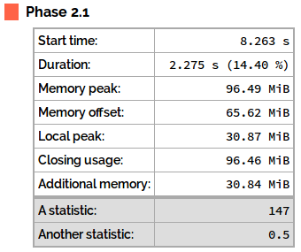
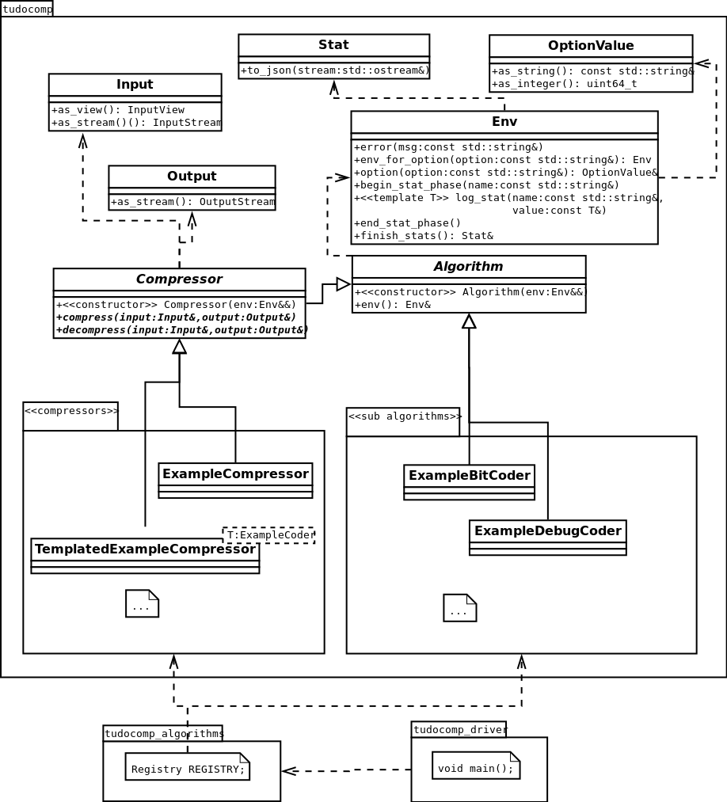

# Abstract

The **T**echnical **U**niversity of **DO**rtmund **COMP**ression Framework
(*tudocomp*) is a lossless compression framework with the aim to support and
facilitate the implementation of novel compression algorithms. It already
comprises a range of standard data compression and encoding algorithms. These
can be mixed and parameterized with the following uses in mind:

* Baseline implementations of well-known compression schemes.
* Detailed benchmarking and comparison of compression and encoding algorithms.
* Easy integration of new algorithm implementations.

# Philosophy

The framework offers a solid and extensible base for new implementations. It is
designed so that most individual processes are modularized and interchangeable.
This way, the user can mix and match algorithms to find the optimal compression
strategy for a given input. The framework gives this opportunity while creating
as little performance overhead as possible.

## Compressor Families

The *compressor families* form the topmost abstraction level in the framework.
Every compression or encoding algorithm belongs to a certain family.

For instance, the compressor family *lzss* (named after
*Lempel-Ziv-Storer-Szymanski*) contains various compressors that factorize the
input resulting in symbols and the produced Lempel-Ziv factors. This output can
then be passed to different encoders specialized for LZSS-type factors to get a
binary encoded compressed file.

## Compressors and Modularity

A *compressor*, in terms of this framework, transforms an input sequence and
writes the result to an output. A compressor is the entry point for the utility.

Each compressor family has to implement a *decompressor* that can restore the
original input losslessly from a compressed output. Apart from that, there are
no strict rules as to *what* kind of transformation of the input occurs. In that
sense, an *encoder* is also a compressor.

Compressors and encoders are implemented in a *modular* way. They are
interchangeable and can be chained (ie the output of one becomes the input of
another).

For instance, a factor-based conpressor consists of three main modules:

1. A *factorizer* that produces factors,
2. a *factor encoder* that encodes these factors, and
3. a *raw symbol encoder* that encodes the remaining, unfactorized input.

In this example, the factorizer divides the input into factors that refer to
substrings of the input. The encoders then encode the factors and any
unfactorized substrings in an independent manner (e.g. human readable or
bit-optimal).

For each of these tasks, there can be different strategies. For instance, the
input can be factorized using a classic online sliding window approach, but one
can also think of using a data structure that works offline and requires the
entire input, such as the suffix array.

Encoders can use myriad representations for the information they encode (e.g.
fixed-width integers, Huffman codes) which may work better or worse for
different types of inputs.

Each of these factorization or encoding strategies can have different
sub-strategies in their own right. The goal of this framework is to modularize
compression and encoding algorithms as much as possible into strategies.

The produced output must contain all information necessary for the respective
decompressor (or decoder) to restore the original input losslessly.

## Library and driver

The framework consists of two major components: the compression *library*
(*tudocomp*) and the framework utility, called the *driver*. The library
contains the core interfaces and provides implementations of various
compressors; the driver provides the interface for the user in the form of an
executable.

The driver uses a *registry* of compressors, which acts as the link between the
driver and the library. The library is a fully functional standalone library
such that third party applications can make use of the provided compressors.

>> *TODO*: Create a data flow diagram for a whole compression cycle.

# Features

>> *TODO*: We should probably have something like a feature overview.

# Usage

## Library

The library comes as a set of `C++` headers where most of the implementations
are inlined.

Development of new compression or encoding algorithms is intended to take place
within *tudocomp*'s repository itself. In order to use *tudocomp* as a library
for a third-party application, the custom `malloc_count` module, which includes
overrides of `malloc`, `free` etc. for the heap memory usage counters,
(`libmalloc_count.a`) needs to be linked.

>> *TODO*: We should probably rename our `malloc_count` module to avoid
           confusion.

The [Doxygen documentation](@URL_DOXYGEN@) provides an overview of the available
compression and encoding implementations as well as the framework's full API.

### Dependencies {#dependencies}

The framework is built using [CMake](https://cmake.org) (2.8 or later).
It is written in `C++11` with GNU extensions and has been tested with the `gcc`
compiler family (version 4.9.2 or later) and `clang` (version 3.5.2 or later).

It has the following external dependencies:

* [SDSL](https://github.com/simongog/sdsl-lite)
  (2.1 or later).
* [Gflags](https://gflags.github.io/gflags) (2.1.2 or later).
* [Google Logging (glog)](https://github.com/google/glog) (0.34 or later).

Additionally, the tests require
[Google Test](https://github.com/google/googletest) (1.7.0 or later).

The CMake build scripts will either find the external dependencies on the build
system, or automatically download and build them from their official
repositories in case they cannot be found.

For building the documentation, the following tools are required:

* LATEX (specifically the `pdflatex` component)
* [Doxygen](http://doxygen.org) (1.8 or later).
* [Pandoc](http://pandoc.org) (1.16 or later).
* [Python](https://www.python.org/) (optional, 2.7 or later).
* [pandocfilters (Python module)](https://pypi.python.org/pypi/pandocfilters)
  (optional, 1.3 or later).

## Framework driver utility

The main executable `tudocomp_driver` is a command line tool that bundles all
implemented algorithms. It provides a fast and easy way to compress and
decompress a file with a specified chain of compressors.

It is called the *driver* because it makes available the library functionality
for command-line usage.

Every registered compression or encoding algorithm will be listed in the help
output of the driver utility when passing the `--list` command-line argument.

## Building on Windows

On Windows, the framework can be built in a [Cygwin](https://www.cygwin.com/)
environment. `mingw` and Microsoft Visual Studio are *not* supported at this
point.

> *Note:* In a *Cygwin* environment, due to its nature of not allowing overrides
          of `malloc` and friends, the `malloc_count` module is not functional,
          ie. memory heap allocation cannot be measured.

## License

The framework is published under the
[GNU General Public License, Version 3](https://www.gnu.org/licenses/gpl-3.0.en.html).

# Tutorial

This chapter provides a guided tour through the implementation of a compressor,
spanning much of the framework's functionality. The following topics will be
discussed:

- Building the framework
- Understanding the framework's file structure
- Using the framework's I/O abstractions
- Writing a simple compressor by implementing the `Compressor`
  interface
- Implementing unit tests
- Adding basic time and memory statistics tracking
- Adding runtime options  select different behavior
- Adding compile time (template) options to your code to select
  different behaviors that should not be selected at runtime due to performance reasons.
- Registering a compressor in the driver registry
- Using the `tudocomp_driver` command line tool with the newly implemented compressor
- Using the `compare_tool` for benchmarking the compressor against other compressors
  for different inputs

You may also refer to an [UML overview](#uml-type-overview) of the framework.

## Building the framework

The tutorial assumes a clean clone of the [*tudocomp* git repository](about:blank).
*tudocomp* is set up as a CMake project[^cmake].

[^cmake]: [CMake](https://cmake.org/) processes the `CMakeLists.txt` files
          throughout the source tree and produces Makefiles for building
          with `make`.

The standard procedure to build is to create a directory named `build` and use
this as CMake's workspace to generate Makefiles. The produced binaries will later
also be placed in the `build` directory tree.

Let us create the build workspace and generate the project Makefiles:

~~~
.../tudocomp> mkdir build
.../tudocomp> cd build
.../tudocomp/build> cmake ..
~~~

When successful, the output ends with `-- Build files have been written to: [...]`.
In case of an error, please make sure the required [dependencies](#dependencies)
are available on the build system.

By default, the project is configured to build in *Debug* mode. While this is
useful for development and debugging, we recommend running benchmarks with the
framework built in *Release* mode. This is achieved by passing the build
configuration to CMake as follows:

~~~
.../build> cmake -DCMAKE_BUILD_TYPE=Release ..
~~~

Debug mode can likewise be configured explicitly:

~~~
.../build> cmake -DCMAKE_BUILD_TYPE=Debug ..
~~~

With the Makefiles generated by CMake, the framework can be built simply
by invoking `make`:

~~~
.../build> make
[... make output ...]
~~~

To ensure everything is working correctly, the `check` target will invoke
the entire unit test range (which can take a while):

~~~
.../build> make check
[... gtest output ...]
All tests were successful!
~~~

## The framework's file structure

*tudocomp*'s root directory structure follows that of a typical C++ project.
The `include` directory contains the framework's C++ headers, `src` contains
the C++ sources. The unit tests (*Google Test*) are located in `test`. The
remaining directories help structure the project further, but they are not
needed for this tutorial.

Note that *tudocomp* is concepted as a header-only library. While the driver
application and the `malloc_count` module need to be implemented in C++ source
files, all compression and coding algorithm implementations come in the form
of templated classes with inlined functions in the `include` tree.

This is a design decision that allows for the compiler to do heavy code
optimization. Due to the nature of almost everything being templated, this
makes development more convenient as well.

## Input and Output

Before going into the details of compressor implementation, this section will
present one of the framework's core components in its I/O abstractions.

As described in the [Philosophy](#philosophy) chapter, (de)compression, by means
of this framework, processes data by reading from an input and writing to an
output. The framework provides an abstraction for this in the two classes
[`Input`](@URL_DOXYGEN_INPUT@) and [`Output`](@URL_DOXYGEN_OUTPUT@). Both hide
the actual source or sink of the data (e.g. a file or a place in memory).

This section will describe their usage only briefly, but they will be presented
"in action" in the following sections of the tutorial.

### Reading an Input

An [`Input`](@URL_DOXYGEN_INPUT@) can be created from different data sources:

* a memory pointer (e.g. a string literal),
* a byte buffer (`std::vector<uint8_t>`),
* a file or
* an input stream(`std::istream`)[^direct-streaming].

For each type of data source, the `Input` class provides a corresponding
constructor:

~~~ {.cpp}
// Create an Input from a string literal
Input input_from_memory("This is the input data");

// Create an Input from a given byte buffer (std::vector<uint8_t>)
Input input_from_buffer(buffer);

// Create an Input from a file
Input input_from_file(Input::Path{"example.txt"});

// Create an Input from a given std::istream
Input input_from_stream(std::cin); // from stdin
~~~

[^direct-streaming]: Currently, direct streaming from an `std::istream` is not
supported. When an `Input` is constructed from an `istream`, the stream is fully
read and buffered in memory. This is an implementation decision that may change
in the future. Note that files, on the other hand, are not buffered and will
always be streamed from disk directly.

The input can be accessed in two conceptually different ways:

1. As a *stream*, requiring bytes to be read sequentially from the input source
   (the concept of online algorithms) or
2. as a *view*, providing random access to the input source as to an array of
   bytes (the concept of offline algorithms).

The choice is done by acquiring the respective object from either the
[`as_stream`](@URL_DOXYGEN_INPUT_ASSTREAM@) or the
[`as_view`](@URL_DOXYGEN_INPUT_ASVIEW@) function. The stream object returned by
`as_stream` conforms to the `std::istream` interface and also provides iterator
access. The object returned by `as_view` provides the indexed access `[]`
operator for and the function `size()` to return the amount of bytes available
on the input.

The following code snippet demonstrates using a given input as a view:

~~~ { .cpp }
auto iview = input.as_view(); //retrieve an input view
auto iview2 = iview; // create a shallow copy of the view

// compare the view's content against a certain string
// the CHECK macro is Google Logging's "assert"
CHECK(iview == "foobar");

auto sub_view = iview.substr(1, 5); // create a sub-view for a range within the main view
CHECK(sub_view == "ooba"); // assertion for the sub-view's contents

// iterate over the whole view character-wise
for (size_t i = 0; i < iview.size(); i++) {
    uint8_t c = iview[i];
    // ...
}
~~~

Note that copies and sub-views are shallow, ie. they point to the same memory
location as the original view and thus have the same content.

In contrast, The following code snippet demonstrates using an input as a stream:

~~~ { .cpp }
auto istream = input.as_stream(); // retrieve an input stream
auto istream2 = istream; // create a second stream as a "rewind" position

// read the input character-wise using a C++11 range-based for loop
for(uint8_t c : istream) {
    // ...
}

// read the input character-wise using the std::istream interface
char c;
while(istream2.get(c)) {
    // ...
}
~~~

Note how the framework uses the `uint8_t` (unsigned byte) type to represent
characters. This is contrary to the `std` library, which uses C's `char` type.

Furthermore, note how `istream2` is created as a copy of `istream`. This way,
`istream2` points at the same stream position as `istream` at the time the
copy is created and can be used as a "rewind" point for use independently
of `istream`.

### Producing an Output

An [`Output`](@URL_DOXYGEN_INPUT@) can be created for different data sinks:

* a byte buffer (`std::vector<uint8_t>`),
* a file or
* an output stream (`std::ostream).

Like `Input`, it provides a constructor for each type of sink:

~~~ {.cpp}
// Create an Output to a given byte buffer (std::vector<uint8_t>)
Output output_to_buffer(buffer);

// Create an Output to a file:
Output output_to_file1("example.txt", false); // do not overwrite if exists (default)
Output output_to_file2("example.txt", true); // overwrite if exists

// Create an Output to a given std::ostream
Output output_to_stream(std::cout); // to stdout
~~~

>> *TODO*: Creating an output to a file is inconsistent compared to creating an
           input from a file: for `Input`, there is `Input::Path`, while
           `Output` takes a string.

An output has to be generated sequentially and thus only provides a stream
interface. The following code snippet demonstrates this by copying an entire
input to an output:

~~~ { .cpp }
auto istream = input.as_stream(); // retrieve the input stream
auto ostream = output.as_stream(); // retrieve the output stream

// copy the input to the output character by character
for(uint8_t c : istream) {
    ostream << c;
}
~~~

### Bitwise I/O

The framework provides the classes [`BitIStream`](@URL_DOXYGEN_BITISTREAM@) and
[`BitOStream`](@URL_DOXYGEN_BITOSTREAM@) for bitwise input and output. They are
wrappers around `std::istream` and `std::ostream`, respectively, and provide
functionality to read or write bits or fixed-width (MSBF order) integers from
their underlying stream.

The following example performs several bitwise write operations on an output:

~~~ {.cpp}
auto ostream = output.as_stream(); // retrieve an output stream
BitOStream obits(ostream); //construct the bitwise output stream

obits.write_bit(0);     // write a single unset bit
obits.write_bit(1);     // write a single set bit
obits.write_int(27, 5); // write the value 27 using 5 bits (11011)
obits.write_int(27, 3); // write the value 27 using 3 bits (truncated to 011)

int a = 27;
obits.write_int(a); // write the value 27 using 8*sizeof(int) bits (32)
                    // (00000000000000000000000000011011)

uint8_t b = 27;
obits.write_int(b); // write the value 27 using 8*sizeof(uint8_t) bits (8)
                    // (00011011)

obits.flush(); //(!) flush the buffer byte
~~~

Note how `write_int` will use the default size of the passed integer type if
no bit width is explicitly given in the second argument.

The last operation, [`flush()`](@URL_DOXYGEN_BITOSTREAM_FLUSH@), is
_required_ after each batch of bitwise write operations (e.g. when
`ostream` is closed or used otherwise). `BitOStream` internally writes to a
buffer byte that is written to the underlying `std::ostream` whenever it is full
(ie. eight bytes have been written). `flush` will force the buffer byte to be
written; its remaining bits will be unset (zero).

The following example performs several bitwise read operations from an input:

~~~ {.cpp}
auto istream = input.as_stream(); // retrieve an input stream
BitIStream ibits(istream); // construct the bitwise input stream

bool bit = ibits.read_bit(); // read a single bit

uint8_t  a = ibits.read_int<uint8_t>(5); // read a 5-bit integer into a uint8_t
uint16_t b = ibits.read_int<uint16_t>;   // read a 16-bit integer
~~~

Note how `read_int` requires a template parameter in order to "know" into which
data type the read integer will be stored. If no bit width is given, the default
size of the data type will be used.

>> *TODO*: Describe variable-width integers once wording and implementation are
           correct.

## A Simple Compressor

This section presents the steps necessary to implement a simple compressor. The
implementation that is developed here is available in the framework's
repository in the `/include/tudocomp/example/` directory.

### Implementing the Compressor interface

Any compressor needs to implement the [`Compressor`](@URL_DOXYGEN_COMPRESSOR@)
interface. A complete implementation consists of

* a constructor accepting an rvalue reference to an environment
  (`Env&&`),
* implementations of the `compress` and `decompress` functions (so that the
  output of `compress`, when passed as the input of `decompress`, will be
  transformed back to the original input of `compress`),
* a static function `meta()` that yields a `Meta` information
  object about the compressor.

Note that while the latter (`meta()`) is not strictly defined in the
`Compressor` class, it is required due to the nature of templated construction.

The class [`Env`](@URL_DOXYGEN_ENV@) represents the compressor's runtime environment.
It provides access to runtime options as well as the framework's statistics
tracking functionality. A compressor conceptually owns[^cpp11-ownership] its
environment, therefore the constructor takes an rvalue reference to it. The
reference should always be delegated down to the base constructor
(using `std::move`).

[^cpp11-ownership]: This refers to the C++11 ownership semantics, ie. a
`unique_ptr<Env>` is stored internally.

A [`Meta`](@URL_DOXYGEN_META@) object contains information about an algorithm
(e.g. compressors) such as its name and type. This information is used by the
generic algorithm constructor `create_algo`, which will be explained below, as
well as for the registry of the driver utility.

The following example header (`/include/tudocomp/example/ExampleCompressor.hpp`)
contains a minimal `Compressor` implementation named `ExampleCompressor`:

~~~ { .cpp }
// [/include/tudocomp/example/ExampleCompressor.hpp]

#ifndef _INCLUDED_EXAMPLE_COMPRESSOR_HPP_
#define _INCLUDED_EXAMPLE_COMPRESSOR_HPP_

#include <tudocomp/tudocomp.hpp>

namespace tdc {

class ExampleCompressor : public Compressor {
public:
    inline static Meta meta() {
        Meta m("compressor", "example_compressor",
               "This is an example compressor.");

        return m;
    }

    inline ExampleCompressor(Env&& env) : Compressor(std::move(env)) {
    }

    inline virtual void compress(Input& input, Output& output) override {
    }

    inline virtual void decompress(Input& input, Output& output) override {
    }
};

}

#endif
~~~

The [`tdc`](@URL_DOXYGEN_TDC@) namespace contains most of the core types
required for implementing compressors, including the `Compressor` interface
and the `Env` and `Meta` types.

The `Meta` object returned by `meta()` contains the following information:

* The algorithm type (in this case, a `"compressor"`),
* the algorithm's identifier (for shell compatibility, this should not contain
  any spaces or special characters) and
* a brief description of the algorithm (which would be displayed in the driver
  utility's help output).

### Example: Run-Length Encoding

The following example implements the `compress` method so that it yields a
run-length encoding of the input. In run-length encoding, sequences (runs)
of the same character are replaced by one single occurence, followed by the
length of the run.

For example, the input `"abcccccccde"`, which contains a run of seven `c`
characters, is encoded as `"abc%6%de"`, where `%6%` designates that the
preceding character is repeated six times. This way, the original input can be
restored from the encoded string.

~~~ { .cpp }
inline virtual void compress(Input& input, Output& output) override {
    auto istream = input.as_stream(); // retrieve the input stream
    auto ostream = output.as_stream(); // retrieve the output stream

    char current; // stores the current character read from the input
    char last; //stores the character that preceded the current character
    size_t counter = 0; // counts the length of the run of the current character

    // writes the current run to the output stream
    auto emit_run = [&]() {
        if (counter > 3) {
            // if the run exceeds 3 characters, encode the run using the %% syntax
            ostream << last << '%' << counter << '%';
        } else {
            // otherwise, do not encode and emit the whole run
            for (size_t i = 0; i <= counter; i++) {
                ostream << last;
            }
        }
    };

    // retrieve the first character on the stream
    if (istream.get(last)) {
        // continue reading from the stream
        while(istream.get(current)) {
            if (current == last) {
                // increase length of the current run
                counter++;
            } else {
                // emit the previous run
                emit_run();

                // continue reading from the stream, starting a new run
                last = current;
                counter = 0;
            }
        }

        // emit the final run
        emit_run();
    }
}
~~~

The decoding is handled by the `decompress` method as follows. It attempts to
find patterns of the form `c%n%` and writes the character `c` to the output
`n` times. Any character not part of such a pattern will simply be copied to
the output.

~~~ { .cpp }
inline virtual void decompress(Input& input, Output& output) override {
    auto iview = input.as_view(); // retrieve the input as a view (merely for educational reasons)
    auto ostream = output.as_stream(); // retrieve the output stream

    char last = '?'; // stores the last character read before a "%n%" pattern is encountered

    // process the input
    for (size_t i = 0; i < iview.size(); i++) {
        if (iview[i] == '%') {
            // after encountering the '%' chracter, parse the following characters
            // as a decimal number until the next '%' is encountered
            size_t counter = 0;
            for (i++; i < iview.size(); i++) {
                if (iview[i] == '%') {
                    // conclusion of the "%n%" pattern
                    break;
                } else {
                    // naive decimal number parser
                    counter *= 10;
                    counter += (iview[i] - '0');
                }
            }

            // repeat the previous character according to the parsed length
            for (size_t x = 0; x < counter; x++) {
                ostream << last;
            }
        } else {
            // output any character not part of a "c%n%" pattern and continue reading
            ostream << iview[i];
            last = iview[i];
        }
    }
}
~~~

Note that this implementation will obviously not work if the original input
contained the `%` character. It merely serves as an example.

> *Exercise*: Implement the `decompress` method using the input as stream
rather than a view.

### Magic

In order to identify what compressor has been used to produce a compressed
output, the driver utility (described later on) can prepend a unique identifier
(*magic keyword*) to the output.

It is important to note that this is *not* the responsibility of the compressor.

## Unit Tests

This section provides a guide to implementing unit tests for the framework.
Unit testing is done with the aid of the
[Google Test](https://github.com/google/googletest) library. The test sources
are located in the `test` directory in the repository root.

### Registering and Running unit tests

The test source files categorize the unit tests into test suites and are
registered in the `CMakeLists.txt` file.

The generated Makefile contains a target for registered each test suite.
For example, `make tudocomp_tests` invokes the `tudocomp_tests` suite which is
contained in `tudocomp_tests.cpp`. The `check` target executes all registered
test suites in succession.

The `sandbox_tests` suite is ignored by the framework's repository and can be
used for quick developmental tests to avoid the registration procedure.

A test suite consists of including the *Google Test* library and at least one
unit test as follows, starting with an empty `example_tests.cpp`

~~~ { .cpp }
// [/test/example_tests.cpp]

#include "gtest/gtest.h"

TEST(example, test) {
    ASSERT_TRUE(true);
}

~~~

The corresponding registration line in `CMakeLists.txt` looks as follows:

~~~
run_test(example_tests DEPS ${BASIC_DEPS})
~~~

The Makefile generated by CMake will contain a target `example_tests` that
executes the example test suite.

### Implementing unit tests

The following snippet provides a simple unit test for the `ExampleCompressor`
from the previous chapter, the run-length encoder:

~~~ { .cpp }
// [/test/example_tests.cpp]

#include "gtest/gtest.h"

#include <tudocomp/example/ExampleCompressor.hpp>
#include <tudocomp/Algorithm.hpp>
#include <tudocomp/Compressor.hpp>

TEST(example, compress) {
    // instantiate the ExampleCompressor
    auto compressor = tdc::create_algo<ExampleCompressor>();

    // create the input for the test (a string constant)
    tdc::Input input("abcccccccde");

    // create the output for the test (a buffer)
    std::vector<uint8_t> buffer;
    tdc::Output output(buffer);

    // invoke the compress method
    compressor.compress(input, output);

    // retrieve the output as a string
    std::string output_str(buffer.begin(), buffer.end());

    // compare the expected result against the output string to determine test failure or success
    ASSERT_EQ("abc%6%de", output_str);
}
~~~

*tudocomp* provides the [`create_algo`](@URL_DOXYGEN_CREATEALGO@) function
template that properly instantiates compressors (or more precisely: any class
inheriting from [`Algorithm`](@URL_DOXYGEN_ALGORITHM@)). In this example, the
compressor's input is created from a string constant and the output is linked to
a byte buffer that will be filled. After invoking `compress`, the output is
tested against the expected result.

>> *TODO*: I would like to rename `create_algo` to something memorable like
           `instantiate`.

>> *TODO*: Once we have string generators (random, Markov, ...), they should
be mentioned here.

A typical compression test case should also test that `decompress` restores
the original input when fed the output of `compress`. *tudocomp* provides
a helper function that performs such a compression cycle, which is presented
in the following unit test:

~~~ { .cpp }
#include "tudocomp_test_util.h"

TEST(example, roundtrip) {
    test::roundtrip<ExampleCompressor>("abcccccccde", "abc%6%de");
}
~~~

>> *TODO*: `test::roundtrip` is not in Doxygen!

[`test::roundtrip`](about:blank) performs the following operations: It

1. instantiates the given compressor type (ie. `ExampleCompressor`),
2. passes the input string (ie. `"abcccccccde"`) to the `compress` method,
3. tests the compression result against the second string (ie. `abc%6%de`),
4. passes the compression result to the `decompress` method and
5. tests the decompression result against the input string.

This way, it spans an entire compression cycle. Alternatively, since often the
compression result is not an ASCII string, the expected compression result can
be passed as a vector of bytes like so:

~~~ { .cpp }
TEST(example, roundtrip_bytes) {
    std::vector<uint8_t> v { 97, 98, 99, 37, 54, 37, 100, 101 };
    test::roundtrip<ExampleCompressor>("abcccccccde", v);
}
~~~

>> *TODO*: We need to consider if the term *roundtrip* should be replaced by
   something more meaningful.

## Runtime Statistics

*tudocomp* provides functionality to measure the running time and the peak
amount of dynamically allocated memory (e.h. via `malloc` or `new`) over the
course of a compression or decompression run.

This functionality is accessible via a compressor's *environment* (represented
by the [`Env`](@URL_DOXYGEN_ENV@) class), which can be retrieved using the
[`env()`](@URL_DOXYGEN_ALGORITH_ENV@) function.

Runtime statistics are tracked in *phases*, ie. the running time and memory
peak can be measured for individual stages during a compression run. These
phases may be nested, ie. a phase can consist of multiple other phases. When
a compressor is instantiated (using `create_algo`) it will automatically enter
a *root phase*.

The measured data can be retrieved as JSON for visualization in the
[*tudocomp Charter*](#charter-web-application) or processing in a third-party application.

> *Note:* In a *Cygwin* environment, due to its nature of not allowing overrides
          of `malloc` and friends, memory allocation cannot be measured.

### Usage

Making use of the statistics tracking functions is as easy as sorrounding
single phases with calls to the
[`begin_stat_phase`](@URL_DOXYGEN_ENV_BEGINSTATPHASE@) and
[`end_stat_phase`](@URL_DOXYGEN_ENV_ENDSTATPHASE@) functions like so:

~~~ { .cpp }
env().begin_stat_phase("Phase 1");
    // ... Phase 1
env().end_stat_phase();
env().begin_stat_phase("Phase 2");
    // ... Phase 2
    env().begin_stat_phase("Phase 2.1");
        // ... Phase 2.1, part of Phase 2
    env().end_stat_phase();
    // ... Phase 2
    env().begin_stat_phase("Phase 2.2");
        // ... Phase 2.2, part of Phase 2
    env().end_stat_phase();
    // ... Phase 2
env().end_stat_phase();
~~~

> *Note*: In order to receive meaningful results, each phase should "clean up"
          properly, ie. it should free any memory that is no longer needed after
          the phase is finished.

During any phase, custom statistics can be logged using the
[`log_stat`](@URL_DOXYGEN_ENV_LOGSTAT@) method like so:

~~~ { .cpp }
env().log_stat("A statistic", 147);
env().log_stat("Another statistic", 0.5);
~~~

>> *TODO*: Currently, there are only overloads for integer types. Overloads
   for `bool` and `std::string` should be added at least.

Statistic tracking is concluded using the
[`finish_stats`](@URL_DOXYGEN_ENV_FINISHSTATS@) function, which yields a
reference to a [`Stat`](@URL_DOXYGEN_STAT@) object. The JSON can be written to a
stream or retrieved as a string using its [`to_json`](@URL_DOXYGEN_STAT_TOJSON@)
function overloads:

~~~ { .cpp }
// finish statistics
auto& stats = compressor.env().finish_stats();

// print JSON to a stream directly
stats.to_json(std::cout);

// retrieve JSON as string
std::string json = stats.to_json();
~~~

### Charter Web Application

The [tudocomp Charter](@URL_CHARTER@) is a JavaScript-based web application
that visualizes the statistics JSON output. Based on the data, it plots a
bar chart that displays the single phases of the compression run with their
running time on the X axis and their peak heap memory usage on the Y axis.

The dashed line within a phase bar displays the *memory offset* of the phase,
ie. how much memory was already allocated at the beginning of the phase. Ergo,
the top border of the bar displays the global, application-wide memory peak
during the phase, while the phase's local memory peak is the difference between
the top and the dashed line.

This information is explicitly printed in table view below the diagram. This is
also where custom statistics are printed. The table view of a phase will also be
displayed as a tooltip when the mouse is moved over its bar in the diagram.

The Charter provides several options to customize the chart, as well as
exporting it as either a vector graphic (`svg`) or an image file (`png`).

## Options

In *tudocomp*, algorithms can take runtime *options* that may alter their
behaviour (e.g. the minimum length of a run before it is replaced in the
run-length code example above). These options can be passed, for instance,
via the command-line when invoking the driver application.

The framework knows two different types of runtime options, *dynamic* options
and *templated* options. The options that an algorithm takes are defined in
its meta information object.

### Dynamic Options

Dynamic options are options that accept values of any type that can be parsed
from a string representation (because options passed from a command-line, for
instance, are generally in string representation). For primitive types such
as booleans or integers, parsers are predefined in the
[`OptionValue`](@URL_DOXYGEN_OPTIONVALUE@) class.

In the following examples, two dynamic options are introduced to the
[run-length encoder](#example-run-length-encoding) example in the `Compressor`'s
meta information object. The `minimum_run` option will determine the minimum
length of a run before it is encoded (4 by default), while the `rle_symbol`
option defines the separation symbol used to use for encoding runs.

~~~ {.cpp}
inline static Meta meta() {
    Meta m("compressor", "example_compressor",
           "This is an example compressor.");

    //Define options
    m.option("minimum_run").dynamic("4");
    m.option("rle_symbol").dynamic("%");

    return m;
}
~~~

The `Meta`'s [`option`](@URL_DOXYGEN_META_OPTION@) method introduces a new
option. Using [`dynamic`](@URL_DOXYGEN_OPTIONBUILDER_DYNAMIC@), this option
is declared a dynamic option with the specified default value. The default value
is used when the option's value was not explicitly passed (ie. via the command
line).

In the following snippet, these options are used to alter the actual run-length
encoding done by the `emit_run` function:

~~~ {.cpp}
// read the option values
auto minimum_run = env().option("minimum_run").as_integer();
auto rle_symbol = env().option("rle_symbol").as_string();

// writes the current run to the output stream
auto emit_run = [&]() {
    if (counter >= minimum_run) {
        // if the run exceeds the minimum amount of characters,
        // encode the run using using the RLE symbol syntax
        ostream << last << rle_symbol << counter << rle_symbol;
    } else {
        // otherwise, do not encode and emit the whole run
        for (size_t i = 0; i <= counter; i++) {
            ostream << last;
        }
    }
};
~~~

Note how options are accessible via the environment's
[`option`](@URL_DOXYGEN_ENV_OPTION@) function, which returns the corresponding
[`OptionValue`](@URL_DOXYGEN_OPTIONVALUE@) object.

> *Exercise*: Modify the decompression of the run-length encoder so that it
              uses the `rle_symbol` option as well.

### Templated Options

Since algorithms are meant to be modular, the framework provides functionality
to pass a sub-algorithm as an option of the main algorithm, which the main
algorithm then instantiates at runtime. This is done using templated options.

The following example declares the main algorithm,
`TemplatedExampleCompressor`, with a template parameter `encoder_t` and the
correspondig templated option:

~~~ {.cpp}
template <typename encoder_t>
class TemplatedExampleCompressor : public Compressor {
public:
    inline static Meta meta() {
        Meta m("compressor", "example_compressor",
               "This is an example compressor.");

        //Define options
        m.option("encoder").templated<encoder_t>();

        return m;
    }

    // ...
};
~~~

The following snippet shows an alternative implementation of the
[run-length encoder](#example-run-length-encoding)'s `compress` function using
the templated option:

~~~ {.cpp}
inline virtual void compress(Input& input, Output& output) override {
    auto istream = input.as_stream(); // retrieve the input stream
    auto ostream = output.as_stream(); // retrieve the output stream

    char current; // stores the current character read from the input
    char last; //stores the character that preceded the current character
    size_t counter = 0; // counts the length of the run of the current character

    // create the encoder
    encoder_t encoder(env().env_for_option("encoder"));

    // retrieve the first character on the stream
    if (istream.get(last)) {
        // continue reading from the stream
        while(istream.get(current)) {
            if (current == last) {
                // increase length of the current run
                counter++;
            } else {
                // emit the previous run
                encoder.emit_run(last, counter);

                // continue reading from the stream, starting a new run
                last = current;
                counter = 0;
            }
        }

        // emit the final run
        encoder.emit_run(last, counter);
    }
}
~~~

Note how in this example, the template type `encoder_t` is used to create an
encoder. The function `emit_run` has been removed, instead the type `encoder_t`
is expected to declare `emit_run` accepting two parameters: the character and
the length of the run. This way, the actual encoding has been made *modular*.

The function [`env_for_option`](@URL_DOXYGEN_ENV_ENVFOROPTION@) is used to
create an environment from the current environment's `"encoder`" option.
`encoder_t` accepts this in its constructor and get nested options from it.

For instance, `encoder_t` could accept the dynamic options `minimum_run` and
`rle_symbol` and encode a run like in the previous section. However, as long as
`encoder_t` provides the `emit_run` function, it could use any arbitrary
strategy to encode the run. In either scenario, the `decompress` method would
have to use the sub-algorithm as well in order to decode the runs correctly.

> *Example*: A full example of the `TemplatedExampleCompressor` is available in
             the `include/tudocomp/example` directory in the framework's
             repository. Most of the framework's compressor implementations
             follow this scheme and can be viewn as advanced examples as well.

### Unit Testing with Options

>> *TODO*: `test::roundtrip` is not in Doxygen!

In the [Unit Tests](#unit-tests) section, the [`test::roundtrip`](about:blank)
method was introduced for testing a compression cycle. In another overload,
additionally to the input and expected encoding, options can be passed as a
third argument like so:

~~~ {.cpp}
TEST(example, roundtrip_options) {
    // Test with options
    test::roundtrip<ExampleCompressor>("abcccccccde", "abc#6#de",  "minimum_run = 7, rle_symbol = '#'");
    test::roundtrip<ExampleCompressor>("abccccccde",  "abcccccde", "minimum_run = 7, rle_symbol = '#'");

    // Test defaults
    test::roundtrip<ExampleCompressor>("abcccccccde", "abc%6%de");

    // Test partially with defaults
    test::roundtrip<ExampleCompressor>("abcccccccde", "abc%6%de",  "minimum_run = 7");
    test::roundtrip<ExampleCompressor>("abccccccde",  "abcccccde", "minimum_run = 7");
    test::roundtrip<ExampleCompressor>("abccccde",    "abc#3#de",  "rle_symbol = '#'");
    test::roundtrip<ExampleCompressor>("abcccde",     "abcccde",   "rle_symbol = '#'");
}
~~~

Note how options that are not passed will take their default values.

While options are generally passed following a simple syntax (`option = value`,
separated by `,`), options to nested algorithms are passed like so:

>> *TODO*: Roundtrip for `TemplatedExampleCompressor` .

>> XXX

>> *TODO*: ...

### Rewrite

> ### Option Syntax and Testing

By adding new options to the algorithm we have to add additional tests covering
the new possibilities of how the algorithm may work.
In order to understand how this works,
we briefly look at the command line syntax used for specifying an algorithm and its options.

An algorithm is specified with an id string that concisely
specifies all (sub)algorithms and options it takes. The syntax works
like a function call that supports keyword arguments and default arguments.

As an example, say we have an algorithm `foo` that accepts a string option
`opt1` with default value `'qux'` and a string option `opt2` with default
value `'bar'`, then all of these are valid id strings:

 Id string                            | Full meaning
--------------------------------------|------------
 `foo`                                | `foo(opt1='qux',opt2='bar')`
 `foo()`                              | `foo(opt1='qux',opt2='bar')`
 `foo('x')`                           | `foo(opt1='x',  opt2='bar')`
 `foo('x', 'yz')`                     | `foo(opt1='x',  opt2='yz' )`
 `foo('123', opt2='456')`             | `foo(opt1='123',opt2='456')`
 `foo(opt2 = 'asd', opt1 = 'xkc')  `  | `foo(opt1='xkc',opt2='asd')`
 `foo(opt2 = '...')`                  | `foo(opt1='qux',opt2='...')`

The reason why the syntax is so complex is that the framework supports
a variety of algorithms with many options; thus it needs a concise
notation for specifying a concrete combination of them that works with
default values (regardless of the ordering of the parameters like python, but unlike C++).

Now, if we go back to our example code, both the
`tudocomp::create_algo()` and the `test::roundtrip()` functions
accept an optional string argument that is used for passing options to the algorithm.
This string has to be written in the same syntax as above, but without the enclosing algorithm's name:

~~~ { .cpp }
tudocomp::create_algo<ExampleCompressor>("'/', true");

test::roundtrip<ExampleCompressor>("abcccccccde", "abc-6-de",
                                   "escape_symbol = '-'");
test::roundtrip<ExampleCompressor>("abcccccccde", "abc%6%de",
                                   "debug_sleep = true");
~~~

You can see this in action in the `compress_stats_options` example test.

## The Registry

Once a compressor implementation exists, and has a few unit tests that
verify the basic operation, it can be registered in the global
algorithm registry in order to be usable from the command line tool.
Adding a compressor to the registry will also result in getting picked by a few automatic unit tests
that run all algorithms with a number of small test cases.

Doing this is easy: In `src/tudocomp_driver/tudocmp_algorithms.cpp`,
add includes for your compressor headers, and then add new `r.compressor<T>()`
lines for all compressor classes in the function body there.

>> *TODO*: where is the function body?

For the templated version, you need to register the class with
all possible combinations of type parameters it can accept, in order to generate native code instance for all of them.

For our running example, we add these three lines:

~~~ { .cpp }
r.compressor<ExampleCompressor>()
r.compressor<TemplatedExampleCompressor<ExampleDebugCoder>>();
r.compressor<TemplatedExampleCompressor<ExampleBitCoder>>();
~~~

If we now run `make check`
(or directly `make tudocomp_driver_algorithm_matrix_tests`), the new
compressors should be picked by the "tudocomp_driver_algorithm_matrix_tests"
target, which will run the previously mentioned tests on them:

~~~
...
example_compressor_0.txt -> example_compressor_0.tdc -> example_compressor_0.decomp.txt ... OK
example_compressor_1.txt -> example_compressor_1.tdc -> example_compressor_1.decomp.txt ... OK
example_compressor_2.txt -> example_compressor_2.tdc -> example_compressor_2.decomp.txt ... OK
example_compressor_3.txt -> example_compressor_3.tdc -> example_compressor_3.decomp.txt ... OK
...
~~~

## The Driver

After integrating a compressor into the registry, we can start using it
with the command line tool.

The "Driver" (named this way because it serves as an user interface that
drives the underlying tudocomp library) can be compiled with `make tudocomp_driver`.
The executable of the driver is stored in `build/src/tudocomp_driver/tudocomp_driver` (after compilation).

As a first step after building it, we can verify that the new compressors
exists by listing all known algorithms:

~~~
.../build> ./src/tudocomp_driver/tudocomp_driver --list
This build supports the following algorithms:

  [Compression algorithms]
  -------------------------------------------------------------------------------------------------------------------------------
  | ...                                                            | ...                                                        |
  -------------------------------------------------------------------------------------------------------------------------------
  | example_compressor(escape_symbol = "%", debug_sleep = "false") | This is an example compressor.                             |
  |   where `escape_symbol` is one of [string],                    |                                                            |
  |         `debug_sleep` is one of [string]                       |                                                            |
  -------------------------------------------------------------------------------------------------------------------------------
  | templated_example_compressor(encoder, debug_sleep = "false")   | This is a templated example compressor.                    |
  |   where `encoder` is one of [example_coder],                   |                                                            |
  |         `debug_sleep` is one of [string]                       |                                                            |
  -------------------------------------------------------------------------------------------------------------------------------

  [Argument types]
    [example_coder]
    -----------------------------------------------------------------------------------------------------------
    | debug(escape_symbol = "%")                 | This is an example debug coder, encoding human readable.   |
    |   where `escape_symbol` is one of [string] |                                                            |
    -----------------------------------------------------------------------------------------------------------
    | bit(escape_byte = "255")                   | This is an example bit coder, encoding as a binary integer.|
    |   where `escape_byte` is one of [string]   |                                                            |
    -----------------------------------------------------------------------------------------------------------

  ...
~~~

Next we will compress something with the tool. Since this is
a quick test, we use an already existing file in the build
directory, the `CMakeCache.txt`:

~~~
.../build> ./src/tudocomp_driver/tudocomp_driver -algorithm "example_compressor" CMakeCache.txt -output ./cache.tdc -stats
~~~

This will create a compressed file `cache.tdc` in the current directory, and
print some statistics to the command line, including the JSON data that
can be pasted into the previously mentioned web visualizer.

> *Note*: The tool will prevent accidental overwrites if a file with the
output filename already exists. To bypass this security mechanism, and hence allow overwriting,
the `-force` option has to be used.

The stat output will likely show a very small compression effect, if any at
all. But the file format contains a few sections decorated with
comments containing repeats of the same character.
If you look at the contents of `cache.tdc`, say with `cat cache.tdc | less`, you should be able to see some
encoding sequences in the file.

As a point of reference, on the authors' machine it only resulted in a 1% reduction, with 4 actual run length replacements.

For a last check, we can see if the decompression works as well:

~~~
.../build> ./src/tudocomp_driver/tudocomp_driver -decompress cache.tdc -output cache.orig.txt
.../build> diff -s CMakeCache.txt cache.orig.txt
Files CMakeCache.txt and cache.orig.txt are identical
~~~

... which seems to be the case.

## The Compare Tool

Last but not least, the framework provides a tool for
automatically running different command line tools on different input text
files.

This "compare_tool" can be used to compare the effects of a compression
algorithm on different classes of input text, or the effects of
different algorithms on the same input files. It can be build with `make compare_tool`.

It's main purpose is to compare the runtime and compression ratio of compressors combined with different options and input files.
However, it does not integrate into the framework's own statistics tracking.

> *Note*: There is also a separate, experimental support for measuring the memory
footprint with the Valgrind tool massif, but this does not work well with
external compression programs. Further, it seems redundant in the light of the memory statistic tracking methods.

The compare tool works as follows:
It takes a config file as a parameter and a profile name.
The config file contains a number of comparison profiles, where each profile has a name.
The compare tool executes the profile in the config file whose name matches with the name passed as the parameter.
While executing the profile, the compare tool prints the results to stdout.

A profile consists of a few options, and two lists. The one list contains the commands
to run, and the other contains the input files. The compare tool
builds the Cartesian product of both lists, and executes each combination
in turn, noting time and compressed size. In the following, we call such a combination a benchmark run.

The config file obeys the [TOML](https://github.com/toml-lang/toml) syntax,
and expects one or more profiles defined like this:

~~~ { .toml }
[PROFILE_NAME]
compare_commands = true # or false
inputs = [
    "FILE1",
    "FILE2",
    # ...
]
commands = [
    ["COMMAND1 --WITH_OPTIONS", "--ADDITIONAL_OPTIONS"],
    ["COMMAND2 --WITH_OPTIONS", "--ADDITIONAL_OPTIONS"],
    # ...
]

[PROFILE2_NAME]
# ...
~~~

`inputs` is the list of input files, and `commands` is the list
of command line commands to run. The commands are split into two
strings that will be merged by the tool. The reason for this split
is that the first part of the command line acts as a label, while
the second part contains some boilerplate arguments (e.g., correctly directing the
input and the output, while being irrelevant for identifying the tool and
algorithm itself).

You can use in the command strings the two special variables `$IN` and `$OUT`
that are substituted by the compare tool with file paths to the input and output filename, respectively.

The `compare_commands` flag decides how the benchmark runs are grouped.
If it is set to `true`, it will run each command in turn on the same input
file; if it is set to `false`, it will run the same command with all input
files:

 `compare_commands = true` | `compare_commands = false`
---------------------------|----------------------------
 `FILE1` run on `COMMAND1`, `COMMAND2` | `COMMAND1` run with `FILE1`, `FILE2`
 `FILE2` run on `COMMAND1`, `COMMAND2` | `COMMAND2` run with `FILE1`, `FILE2`
 ...                                   | ...

### Datasets

Tudocomp provides a target `datasets` that will download a selection
of files, mostly from the [Pizza&Chili Corpus](http://pizzachili.dcc.uchile.cl/texts.html).
At the point of writing this document, the datasets take 9.4 GiB of space.
Make sure you have enough free storage before doing this!

~~~
.../build> make datasets
~~~

> *Note* that the make target can be aborted at any time and will resume
> with what it had already downloaded the next time it gets invoked.

The downloaded files can be found in `/etc/datasets/download`.

This example will use some of those texts.

### Compare Workspace

At this point we already can build the compare tool
and invoke it with a config file.
But this is a bit cumbersome, because:

- The input files and the compare tool can have complex file paths.
- The compare files dumps log files and compression artifacts to the current
  working directory, so it should run in its own directory.

  >> *TODO*: what are compare files dumps log files?

- Changes to the tudocomp codebase will not automatically be recognized
  by the tool.

To address these (arguably minor) concerns the build system offers the target
`compare_workspace`. It will create the directory `/build/compare_workspace`,
and fill it with a short shell script `run.sh` that:

- Invokes the make targets `tudocomp_driver`, `compare_tool` and
  `compare_workspace` to ensure that the built code is up to date.
- Locally appends the binary directory of Tudocomp to`$PATH` such that it does not have to be
  installed or be invoked with the relative/full path.

>> *TODO*: what is "it"?

- Defines an environment variable `$DATASETS` pointing
  to the dataset directory.
- Delegates to the `compare_tool` with the environment
  defined above.

>> *TODO*: what will be delegated? The environment variables? Parameters like below?

This set-up enables us to quickly create a test environment for different algorithms:

~~~
.../build> make compare_workspace
.../build> cd compare_workspace
.../compare_workspace> ./run.sh config.toml example
...
~~~

### An Example Config File

As the last step of this tutorial, we will create a compare config file in the workspace directory for our running example.

Our goal is to compare the three compressor variants we had
defined with a few different input files: English text,
source code, DNA sequences, etc. We use the datasets we downloaded in the previous step.

We create a new text file `/build/compare_workspace/example_config.toml`, and
give it the following content:

~~~ { .toml }
[example]
compare_commands = true
inputs = [
    "$DATASETS/download/real/english.50MB",
    "$DATASETS/download/real/sources.50MB",
    "$DATASETS/download/real/dblp.xml.50MB",
    "$DATASETS/download/real/proteins.50MB",
    "$DATASETS/download/real/dna.50MB",
]
commands = [
    ["tudocomp_driver -algorithm 'example_compressor'",                  "-raw $IN -output $OUT"],
    ["tudocomp_driver -algorithm 'templated_example_compressor(bit)'",   "-raw $IN -output $OUT"],
    ["tudocomp_driver -algorithm 'templated_example_compressor(debug)'", "-raw $IN -output $OUT"],
]
~~~

This content defines a config file with the profile `example`.
The profile `example` runs the algorithms `example_compressor`, `templated_example_compressor(bit)`
and `templated_example_compressor(debug)` on five input texts.
The benchmark runs are grouped by the input files since we want to compare the differences between the algorithms on the same text.

By invoking the run script with this config, we get an output like this:

~~~
.../compare_workspace> ./run.sh example_config.toml example
[ 13%] Built target malloc_count
[ 47%] Built target sdsl_external
[ 82%] Built target gflags_external
[ 91%] Built target tudocomp_algorithms
[100%] Built target tudocomp_driver
[100%] Built target rust_external
[100%] Built target compare_tool
[100%] Built target compare_workspace

Profile: example

file | $DATASETS/download/real/english.50MB                             |   time    |     size     |  comp. size  |  ratio   |     mem
-------------------------------------------------------------------------------------------------------------------------------------------
cmd  | tudocomp_driver -algorithm 'example_compressor'                  |~  1.681 s |    50.00 MiB |    49.85 MiB |  99.71 % |      -
cmd  | tudocomp_driver -algorithm 'templated_example_compressor(bit)'   |~  1.681 s |    50.00 MiB |    49.81 MiB |  99.63 % |      -
cmd  | tudocomp_driver -algorithm 'templated_example_compressor(debug)' |~  1.680 s |    50.00 MiB |    49.85 MiB |  99.71 % |      -
-------------------------------------------------------------------------------------------------------------------------------------------
file | $DATASETS/download/real/sources.50MB                             |   time    |     size     |  comp. size  |  ratio   |     mem
-------------------------------------------------------------------------------------------------------------------------------------------
cmd  | tudocomp_driver -algorithm 'example_compressor'                  |~  1.612 s |    50.00 MiB |    48.49 MiB |  96.97 % |      -
cmd  | tudocomp_driver -algorithm 'templated_example_compressor(bit)'   |~  1.605 s |    50.00 MiB |    48.10 MiB |  96.20 % |      -
cmd  | tudocomp_driver -algorithm 'templated_example_compressor(debug)' |~  1.679 s |    50.00 MiB |    48.49 MiB |  96.97 % |      -
-------------------------------------------------------------------------------------------------------------------------------------------
file | $DATASETS/download/real/dblp.xml.50MB                            |   time    |     size     |  comp. size  |  ratio   |     mem
-------------------------------------------------------------------------------------------------------------------------------------------
cmd  | tudocomp_driver -algorithm 'example_compressor'                  |~  1.641 s |    50.00 MiB |    50.00 MiB | 100.00 % |      -
cmd  | tudocomp_driver -algorithm 'templated_example_compressor(bit)'   |~  1.686 s |    50.00 MiB |    50.00 MiB |  99.99 % |      -
cmd  | tudocomp_driver -algorithm 'templated_example_compressor(debug)' |~  1.772 s |    50.00 MiB |    50.00 MiB | 100.00 % |      -
-------------------------------------------------------------------------------------------------------------------------------------------
file | $DATASETS/download/real/proteins.50MB                            |   time    |     size     |  comp. size  |  ratio   |     mem
-------------------------------------------------------------------------------------------------------------------------------------------
cmd  | tudocomp_driver -algorithm 'example_compressor'                  |~  1.717 s |    50.00 MiB |    49.96 MiB |  99.93 % |      -
cmd  | tudocomp_driver -algorithm 'templated_example_compressor(bit)'   |~  1.637 s |    50.00 MiB |    49.92 MiB |  99.83 % |      -
cmd  | tudocomp_driver -algorithm 'templated_example_compressor(debug)' |~  1.724 s |    50.00 MiB |    49.96 MiB |  99.93 % |      -
-------------------------------------------------------------------------------------------------------------------------------------------
file | $DATASETS/download/real/dna.50MB                                 |   time    |     size     |  comp. size  |  ratio   |     mem
-------------------------------------------------------------------------------------------------------------------------------------------
cmd  | tudocomp_driver -algorithm 'example_compressor'                  |~  1.997 s |    50.00 MiB |    49.31 MiB |  98.62 % |      -
cmd  | tudocomp_driver -algorithm 'templated_example_compressor(bit)'   |~  1.794 s |    50.00 MiB |    48.21 MiB |  96.41 % |      -
cmd  | tudocomp_driver -algorithm 'templated_example_compressor(debug)' |~  1.852 s |    50.00 MiB |    49.31 MiB |  98.62 % |      -
-------------------------------------------------------------------------------------------------------------------------------------------

~~~

We see that the algorithms are not very effective.
As expected, there is no visible difference between the
first compressor, and the second one with the debug encoder.

We can also toggle the `compare_commands` option to group
by the algorithms instead; this allows us to compare how an algorithms performs on different inputs:

~~~
.../compare_workspace> ./run.sh example_config.toml example
[ 34%] Built target sdsl_external
[ 60%] Built target malloc_count
[ 82%] Built target gflags_external
[ 91%] Built target tudocomp_algorithms
[100%] Built target tudocomp_driver
[100%] Built target rust_external
[100%] Built target compare_tool
[100%] Built target compare_workspace

Profile: example

cmd  | tudocomp_driver -algorithm 'example_compressor'                  |   time    |     size     |  comp. size  |  ratio   |     mem
-------------------------------------------------------------------------------------------------------------------------------------------
file | $DATASETS/download/real/english.50MB                             |~  1.829 s |    50.00 MiB |    49.85 MiB |  99.71 % |      -
file | $DATASETS/download/real/sources.50MB                             |~  1.697 s |    50.00 MiB |    48.49 MiB |  96.97 % |      -
file | $DATASETS/download/real/dblp.xml.50MB                            |~  1.787 s |    50.00 MiB |    50.00 MiB | 100.00 % |      -
file | $DATASETS/download/real/proteins.50MB                            |~  1.643 s |    50.00 MiB |    49.96 MiB |  99.93 % |      -
file | $DATASETS/download/real/dna.50MB                                 |~  1.874 s |    50.00 MiB |    49.31 MiB |  98.62 % |      -
-------------------------------------------------------------------------------------------------------------------------------------------
cmd  | tudocomp_driver -algorithm 'templated_example_compressor(bit)'   |   time    |     size     |  comp. size  |  ratio   |     mem
-------------------------------------------------------------------------------------------------------------------------------------------
file | $DATASETS/download/real/english.50MB                             |~  1.678 s |    50.00 MiB |    49.81 MiB |  99.63 % |      -
file | $DATASETS/download/real/sources.50MB                             |~  1.664 s |    50.00 MiB |    48.10 MiB |  96.20 % |      -
file | $DATASETS/download/real/dblp.xml.50MB                            |~  1.630 s |    50.00 MiB |    50.00 MiB |  99.99 % |      -
file | $DATASETS/download/real/proteins.50MB                            |~  1.672 s |    50.00 MiB |    49.92 MiB |  99.83 % |      -
file | $DATASETS/download/real/dna.50MB                                 |~  1.800 s |    50.00 MiB |    48.21 MiB |  96.41 % |      -
-------------------------------------------------------------------------------------------------------------------------------------------
cmd  | tudocomp_driver -algorithm 'templated_example_compressor(debug)' |   time    |     size     |  comp. size  |  ratio   |     mem
-------------------------------------------------------------------------------------------------------------------------------------------
file | $DATASETS/download/real/english.50MB                             |~  1.650 s |    50.00 MiB |    49.85 MiB |  99.71 % |      -
file | $DATASETS/download/real/sources.50MB                             |~  1.746 s |    50.00 MiB |    48.49 MiB |  96.97 % |      -
file | $DATASETS/download/real/dblp.xml.50MB                            |~  1.638 s |    50.00 MiB |    50.00 MiB | 100.00 % |      -
file | $DATASETS/download/real/proteins.50MB                            |~  1.755 s |    50.00 MiB |    49.96 MiB |  99.93 % |      -
file | $DATASETS/download/real/dna.50MB                                 |~  1.838 s |    50.00 MiB |    49.31 MiB |  98.62 % |      -
-------------------------------------------------------------------------------------------------------------------------------------------

~~~

Regarding the compression ratio, the source code file seems to compress best, presumably due
the repetition of indentation characters like tabs and spaces.

# UML Type Overview

# Credits

*tudocomp* was created with the help of ...

| Name | Roles |
| ---- | ----- |
| Dinklage, Patrick | core development, research, documentation |
| Köppl, Dominik    | supervision, advice, research |
| Löbel, Marvin     | core development, documentation |
